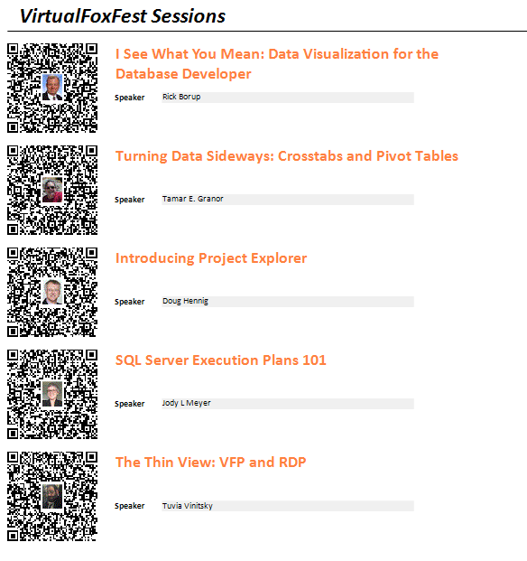

# zintBarcode
## Introduction
**zintBarcode** provides a VFP connector to the [**Zint Barcode Generator**](https://www.zint.org.uk/ "Zint Home") library.

**Zint** is an open source project that implements 1D and 2D barcode symbologies. The VFP connector uses the `zint.dll` library to access the **Zint** API, and it's compatible with versions 2.10 to 2.13 (the last one, at the time of writing).

Developers should refer to the **Zint** documentation for a presentation on the library (Read The [Fine Manual](https://zint.org.uk/manual/ "Fine manual")).

In particular, **zintBarcode** implements the following **Zint** API methods:

| Zint API | ZintBarcode connector  | Feature |
|--|--|--|
| ZBarcode_Encode_And_Print | EncodeSave | Generates a barcode and saves it to a file |
| ZBarcode_Encode | Encode | Generates a barcode |
| ZBarcode_Print | Save | Saves a generated barcode to a file |

**zintBarcode** also implements getters and setters for all input properties of the **Zint** Symbol structure (and getters for the others).

See [zintBarcode Classes](docs/classes.md "Classes") for further documentation.

The **Zint** API is discussed in the [Section 5](https://zint.org.uk/manual/chapter/5 "Using the API") of the manual. The settings that control the generation process are described in point 5.6.

A description of the available symbologies and specific settings for them is presented in [Section 6](https://zint.org.uk/manual/chapter/6/1 "Symbologies").

Additionally, **zintBarcode** implements a high-level method that returns the name of a barcode image file. The name can be used as a Picture or Control Source in VFP reports and forms. See the demo section below, for an example of both scenarios.

As an extension to the original library, **zintBarcode** supports the placement of image overlays on top of the generated barcodes. The demo section also presents a sample case. 

## Setup

**zintBarcode** comes as a [single program file](src/zintbarcode.prg "ZintBarcode"), but depends on the **Zint** Dynamic Link Library, as well as on the **VFP2C32** Fox Link Library.

Both should be downloaded from their sites ([**Zint**](https://sourceforge.net/projects/zint/ "Zint") project; [**VFP2C32**](https://github.com/ChristianEhlscheid/vfp2c32 "VFP2C32") project). For convenience, binary copies of both libraries are stored in this repository.

To overlay an image on the barcode, the [**GdiPlusX**](https://github.com/VFPX/GDIPlusX "GdiPlusX") library must be present in the application environment.

**zintBarcode** is implemented as a class, and to put its definition in scope the command

```foxpro
DO zintbarcode.prg
```

should be issued. Afterward,

```foxpro
LOCAL ZB AS ZintBarcode

m.ZB = CREATEOBJECT("ZintBarcode")
```

will instantiate a **zintBarcode** object.

## Quick demo

In this demo, a QR code is produced and displayed in the VFP's main screen.

**Install the library and its dependencies:**

```foxpro
DO LOCFILE("zintbarcode.prg")
```

**Instantiate a zintBarcode object:**

```foxpro
m.ZB = CREATEOBJECT("ZintBarcode")
```

**Encode a QR barcode:**

```foxpro
m.ZB.SetSymbology(58)
m.ImgFilename = m.ZB.ImageFile("https://vfpx.github.io")
```

**Create an image object in the VFP _Screen:**

```foxpro
_Screen.AddObject("qr", "Image")
```

**Load the barcode into the image:**

```foxpro
_Screen.qr.Picture = m.ImgFilename
```

**Display the image**

```foxpro
_Screen.qr.Visible = .T.
```

## Demos

### zintBarcode in a form


A simple Code 128 generator form. The barcode is regenerated as the user types new text. This is the code for the text control InteractiveChange event:

```foxpro
Thisform.Image1.Picture = Thisform.zs.ImageFile(This.Value, "gif")
Thisform.Text2.Value = Thisform.zs.GetErrorText()
```

To run the demo:

```foxpro
DO FORM demo\code128generator
```

### zintBarcode in a report a)


A Northwind Catalog of current products. The Id can be selected by scanning a barcode.

The barcode image is set when the report cursor is populated (a field in the cursor holds the filename).

```foxpro
SELECT cpl.ProductId, ;
		cpl.ProductName, ;
		m.ZB.Imagefile(TRANSFORM(cpl.ProductId)) AS barcode ;
	FROM Northwind!Current_Product_List cpl ;
	INTO CURSOR curReport
```

To run the demo:

```foxpro
DO demo\northwindCatalog.prg
```

### zintBarcode in a report b)


A report of current VFPX projects. A program fetches the data from the VFPX website, including the URL of the projects, and builds a report for the resulting cursor. The URLs are represented as QR codes (their colors depending on the project status).

A PRIVATE variable ZS points to a **zintBarcode** object that generates the QR for each project. A Picture control source in the report is set to the method that returns the name of the image file for each project's URL.


To run the demo:

```foxpro
DO demo\vfpxprojects.prg
```

### Barcodes with overlay images

Images can be placed over barcodes of any symbology. Since the readability of the barcode may be seriously affected, comprehensive testing is highly recommended.

Overlay images may be used to add a logo to a barcode, or to comply with a requirement imposed by an organization.

Overlay images may be dropped on a barcode as they are, or resized to fit a specific width and height.

In the demo, a report on the sessions of the Virtual Fox Fest produces QR codes with links to the sessions. Each QR code includes a photo of the speaker at its center.

The code section that controls the overlay image:

```foxpro
* use a VFP image as the overlay image
m.ZB.SetOverlay(m.ZB.Photo)
* the size
m.ZB.SetOverlayWidth(34)	&& 30x39, 4 pixels for the margin
m.ZB.SetOverlayHeight(43)
* and a margin
m.ZB.SetOverlayMargin(2)
* isometric resizing (it's the default, anyway)
m.ZB.SetOverlayIsometric(.T.)
* and placed at the center (also the default)
m.ZB.SetOverlayPosition("C")

* the subclassing of ZintBarcode
DEFINE CLASS ZintBarcodeExtended AS ZintBarcode

	ADD OBJECT Photo AS Image

	PROCEDURE DynamicSettings (InputData AS String)

		This.Photo.PictureVal = curVFFSessions.photo   && a blob in a cursor

	ENDPROC

ENDDEFINE
```

The report:



To run the demo:

```foxpro
DO demo\virtualfoxfest.prg
```


## Licensing and acknowledgments

[Unlicensed](UNLICENSE.md "Unlicense").

**Zint** is Copyright © 2023 Robin Stuart, distributed under a BSD license.

**VFP2C32** by Christian Ehlscheid with collaboration of Eric Selje.

**GdiPlusX** by Bernard Bout (*project manager*) et al.

## Status

In development.