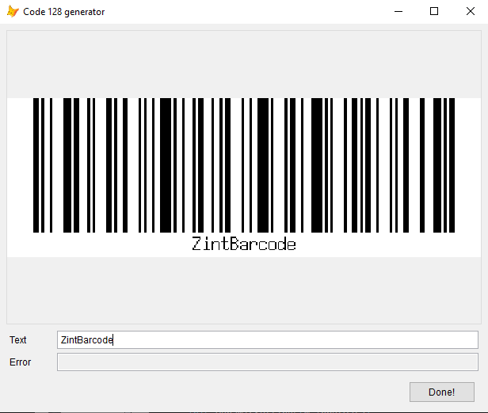
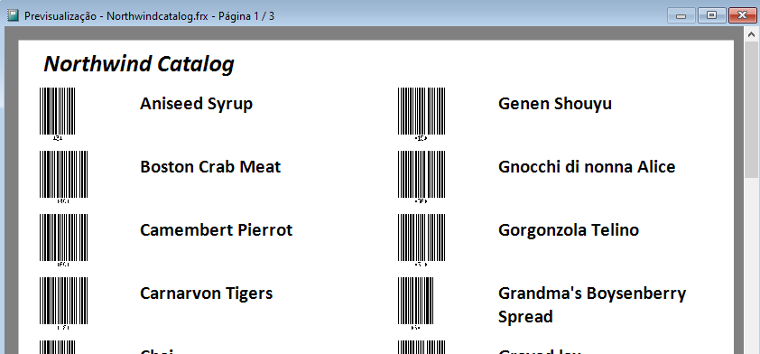
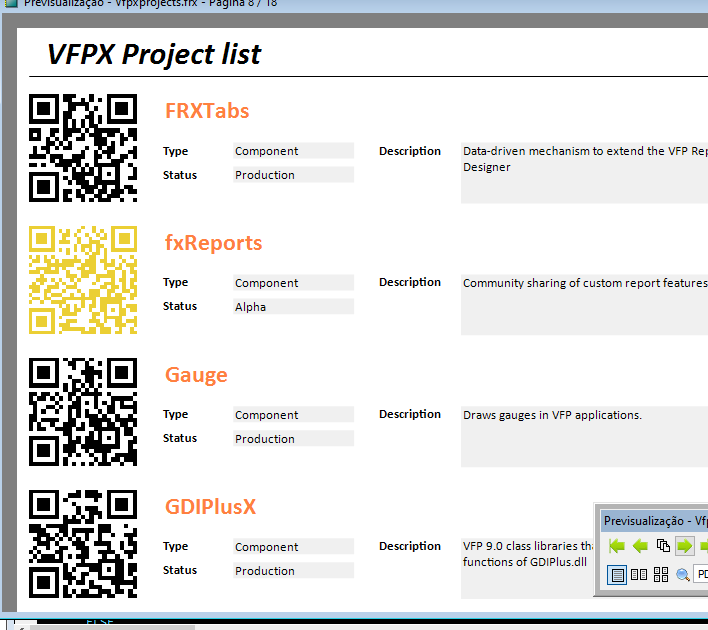
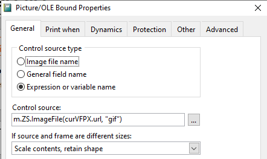

# zintBarcode
## Introduction
**zintBarcode** provides a VFP connector to the [**Zint Barcode Generator**](http://www.zint.org.uk/ "Zint Home") library.

**Zint** is an open source project that implements 1D and 2D barcode symbologies. The VFP connector uses the `zint.dll` library to access the **Zint** API.

Developers should refer to the **Zint** documentation for a presentation on the library (also in full at the [code repository](https://sourceforge.net/p/zint/code/ci/master/tree/docs/manual.txt "Full manual")).

In particular, **zintBarcode** implements the following **Zint** API methods:

| Zint API | ZintBarcode connector  | Feature |
|--|--|--|
| ZBarcode_Encode_And_Print | EncodeSave | Generates a barcode and saves it to a file |
| ZBarcode_Encode | Encode | Generates a barcode |
| ZBarcode_Print | Save | Saves a generated barcode to a file |

**zintBarcode** also implements getters and setters for all input properties of the **Zint** Symbol structure (and getters for the others).

See [zintBarcode Classes](docs/classes.md "Classes") for further documentation.

The **Zint** API is discussed in the [Section 5](http://www.zint.org.uk/Manual.aspx?type=p&page=5 "Using API") of the manual. The settings that control the generation process are described in point 5.5.

A description of the available symbologies and specific settings for them is presented in [Section 6](http://www.zint.org.uk/Manual.aspx?type=p&page=6 "Symbologies").

Additionally, **zintBarcode** implements a high-level method that returns the name of a barcode image file. The name can be used as a Picture or Control Source in VFP reports and forms. See the demo section below, for an example of both scenarios.

## Setup

**zintBarcode** comes as a [single program file](src/zintbarcode.prg "ZintBarcode"), but depends on the **Zint** Dynamic Link Library, as well as on the **VFP2C32** Fox Link Library.

Both should be downloaded from their sites ([**Zint**](https://sourceforge.net/projects/zint/ "Zint") project; [**VFP2C32**](https://github.com/ChristianEhlscheid/vfp2c32 "VFP2C32") project). For convenience, binary copies of both libraries are stored in this repository.

**zintBarcode** is implemented as a class, and to put its definition in scope the command

```foxpro
DO zintbarcode.prg
```

should be issued. Afterward,

```foxpro
LOCAL ZB AS ZintBarcode

m.ZB = CREATEOBJECT("ZintBarcode")
```

will instantiate a **zintBarcode** object.

## Quick demo

In this demo, a QR code is produced and displayed in the VFP's main screen.

**Install the library and its dependencies:**

```foxpro
DO LOCFILE("zintbarcode.prg")
```

**Instantiate a zintBarcode object:**

```foxpro
m.ZB = CREATEOBJECT("ZintBarcode")
```

**Encode a QR barcode:**

```foxpro
m.ZB.SetSymbology(58)
m.ImgFilename = m.ZB.ImageFile("https://vfpx.github.io")
```

**Create an image object in the VFP _Screen:**

```foxpro
_Screen.AddObject("qr", "Image")
```

**Load the barcode into the image:**

```foxpro
_Screen.qr.Picture = m.ImgFilename
```

**Display the image**

```foxpro
_Screen.qr.Visible = .T.
```

## Demos

### zintBarcode in a form



A simple Code 128 generator form. The barcode is regenerated as the user types new text. This is the code for the text control InteractiveChange event:

```foxpro
Thisform.Image1.Picture = Thisform.zs.ImageFile(This.Value, "gif")
Thisform.Text2.Value = Thisform.zs.GetErrorText()
```

To run the demo:

```foxpro
DO FORM demo\code128generator
```

### zintBarcode in a report a)



A Northwind Catalog of current products. The Id can be selected by scanning a barcode.

The barcode image is set when the report cursor is populated (a field in the cursor holds the filename).

```foxpro
SELECT cpl.ProductId, ;
		cpl.ProductName, ;
		m.ZB.Imagefile(TRANSFORM(cpl.ProductId)) AS barcode ;
	FROM Northwind!Current_Product_List cpl ;
	INTO CURSOR curReport
```

To run the demo:

```foxpro
DO demo\northwindCatalog.prg
```

### zintBarcode in a report b)



A report of current VFPX projects. A program fetches the data from the VFPX website, including the URL of the projects, and builds a report for the resulting cursor. The URLs are represented as QR codes (their colors depending on the project status).

A PRIVATE variable ZS points to a **zintBarcode** object that generates the QR for each project. A Picture control source in the report is set to the method that returns the name of the image file for each project's URL.



To run the demo:

```foxpro
DO demo\vfpxprojects.prg
```

## Licensing and acknowledgments

[Unlicensed](UNLICENSE.md "Unlicense").

**Zint** is Copyright © 2020 Robin Stuart, distributed under a BSD license.

**VFP2C32** by Christian Ehlscheid with collaboration of Eric Selje.

## Status

In development.